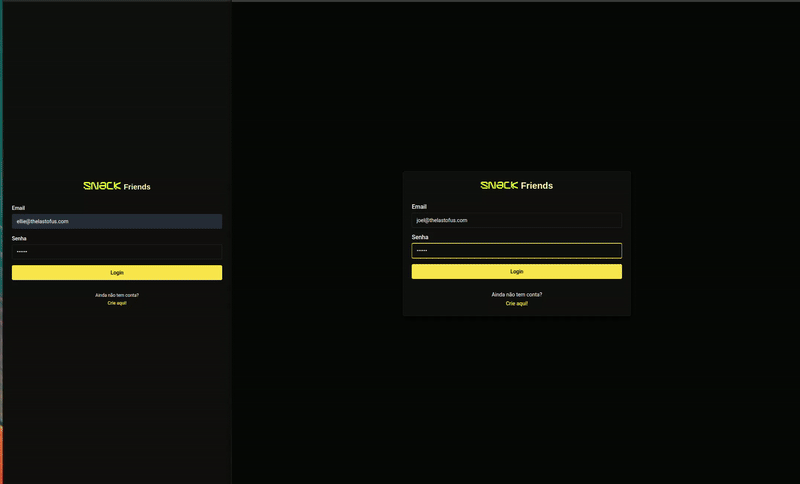
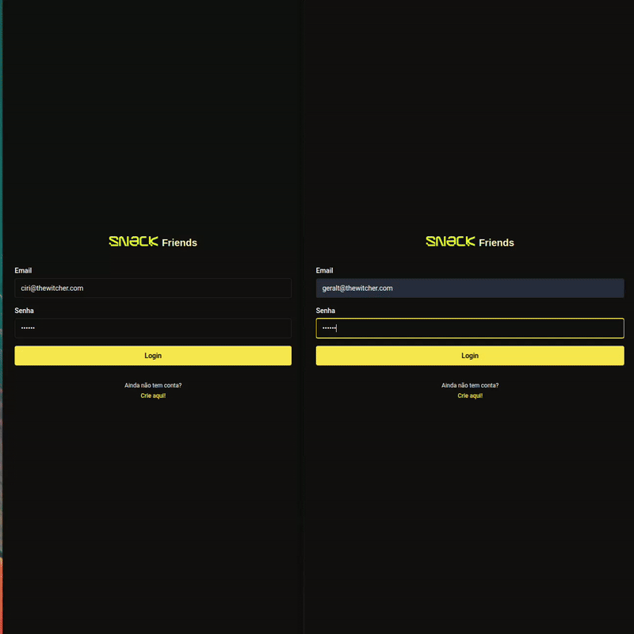

### Front-end Friend Challenge - Snack Friends

This project simulates a friendship system with real-time notifications, and I used WebSocket to handle this scenario. The project is built with Next.js, Node.js (version 20 or higher), and uses Docker to streamline the environment setup.

**Prerequisites**

```
Node.js 20 or higher.

Docker and Docker Compose installed.

Browser (recommended: Chrome, Firefox).

```

### Instructions to run the project

**1. Clone the repository**

First, clone the repository to your local environment::

```
git clone git@github.com:gisouzap/frontend-friend-challenge.git 
cd snack-friends
```

**2. Build and start the Docker containers**

The project uses Docker Compose to manage three services:

```
1. WebSocket Server: WebSocket server running on port 8080.

2. App 1: Next.js application running on port 3000.
 
3. App 2: Next.js application running on port 3001.

```

To start the containers, run:

`docker-compose up --build`

This will:

1. Build the Docker images.

2. Start the WebSocket server and the two instances of the Next.js application.

**3. Access the applications**

Once the containers are running, open two incognito tabs in your browser:

Access the first instance at: http://localhost:3000.

Access the second instance at: http://localhost:3001.

_Important: Use incognito tabs (or different browsers) to simulate two distinct users. This is required to test real-time notifications._

**4. To test the features**

Register and Login:
- You can create a new user and send friend requests, but notifications will not be visible here.
- Use mock users to view notifications.

First instance 
```
email: ciri@thewitcher.com
senha: 123456
```


Second instance: 

```
email: geralt@thewitcher.com
senha: 123456
```


**Demo**



